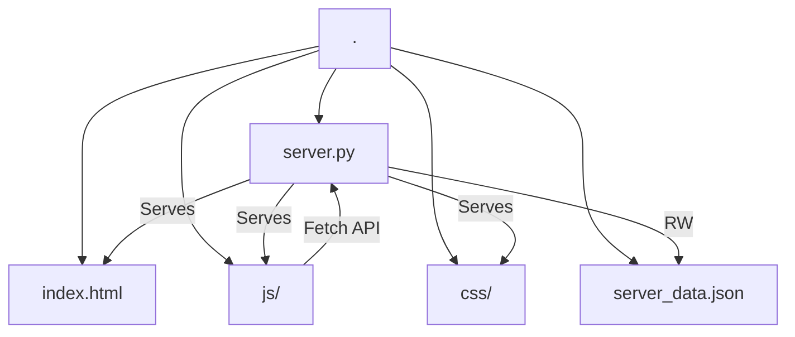

# 情商训练营 (EQ Trainer)

## 项目概览
"情商训练营 (EQ Trainer)" 是一个 Web 应用程序，结合了 Python 后端和原生 HTML/CSS/JS 前端。它提供了一个互动平台，用户可以在此进行情商场景模拟训练，获取 AI 评分和建议，并跟踪个人成长进度。

## 架构说明
项目采用简单的前后端分离架构：
- **Web 前端 (Frontend)**: 原生 HTML/CSS/JavaScript，负责 UI 渲染、用户交互和业务逻辑。
- **Python 服务端 (Backend)**: `http.server`，提供静态资源托管和轻量级 JSON 数据存储接口。

### 目录结构

## 模块索引

- **[Root]**: 后端服务入口与数据存储。
- **[js/]**: 前端核心逻辑模块。
- **[css/]**: 样式定义。

## 全局规范

- **编码格式**: UTF-8
- **前端风格**: 现代原生 JavaScript (ES Modules), CSS Variables。
- **后端风格**: 标准 Python `http.server` 库，避免过度依赖第三方库。
- **数据格式**: JSON

## 常用命令

- **启动服务**: `python server.py` (运行在 8000 端口)
- **开发地址**: `http://localhost:8000`

---
*Generated by Claude Code Assistant - 2026-01-12*
