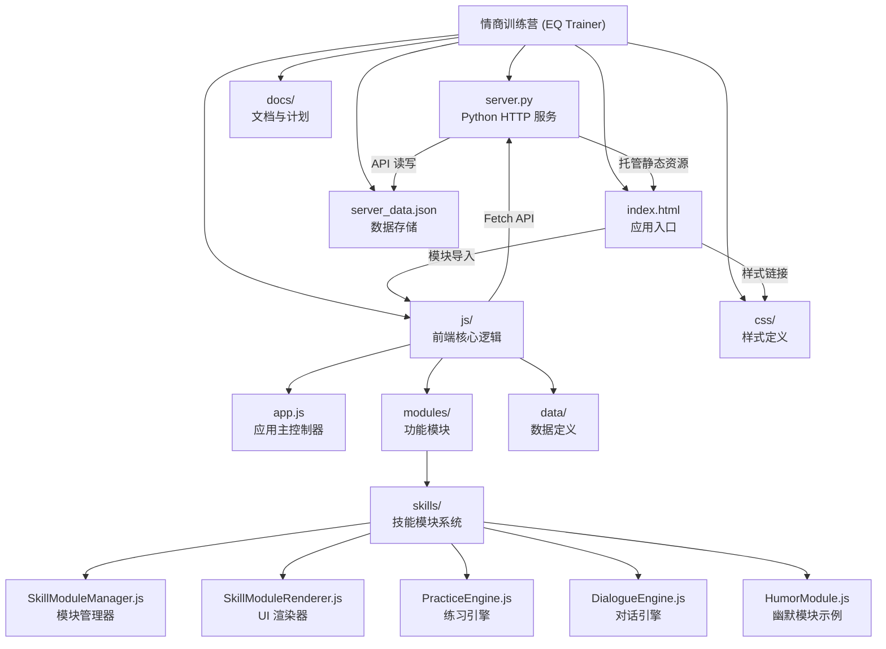
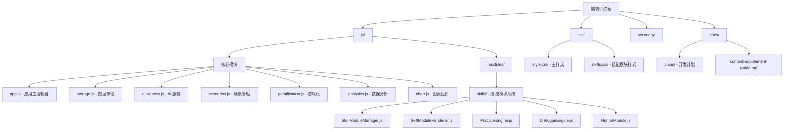

# 情商训练营 (EQ Trainer)

## 变更记录 (Changelog)

### 2026-01-14
- 完成 AI 上下文初始化
- 新增技能模块系统架构文档
- 完善模块结构与导航

---

## 项目概览

"情商训练营 (EQ Trainer)" 是一个 Web 应用程序，结合了 Python 后端和原生 HTML/CSS/JS 前端。它提供了一个互动平台，用户可以在此进行情商场景模拟训练，获取 AI 评分和建议，并跟踪个人成长进度。

### 核心功能
- **场景训练**: 8大分类、200+ 高压场景模拟
- **AI 智能评估**: 基于曾仕强智慧体系的评分与反馈
- **双模式练习**: 单次回答模式 + AI 模拟对话模式
- **技能模块系统**: 理论课、练习、实战三位一体的学习路径
- **游戏化成长**: 等级系统、XP 经验值、徽章成就、训练热力图
- **数据分析**: 雷达图能力分析、弱点智能推荐

## 架构说明

项目采用简单的前后端分离架构：
- **Web 前端 (Frontend)**: 原生 HTML/CSS/JavaScript (ES Modules)，负责 UI 渲染、用户交互和业务逻辑
- **Python 服务端 (Backend)**: `http.server`，提供静态资源托管和轻量级 JSON 数据存储接口

### 目录结构



## 模块结构图



## 模块索引

| 模块路径 | 职责 | 入口文件 | 状态 |
|---------|------|---------|------|
| **[js/](./js/CLAUDE.md)** | 前端核心逻辑 | `app.js` | ✅ 已文档化 |
| **[js/modules/skills/](./js/modules/skills/CLAUDE.md)** | 技能模块系统 | `SkillModuleManager.js` | ✅ 已文档化 |
| **[css/](./css/CLAUDE.md)** | 样式定义 | `style.css` | ✅ 已文档化 |
| **[server.py](./server.py)** | Python HTTP 服务 | `server.py` | ✅ 核心服务 |
| **[docs/](./docs/)** | 项目文档与计划 | - | 📋 文档目录 |

### 关键文件说明

#### 前端核心 (js/)
- **app.js**: 应用主入口，处理路由、事件绑定、初始化
- **ai-service.js**: AI 评分、对话生成、场景生成服务
- **storage.js**: 本地存储 + 服务器同步逻辑
- **scenarios.js**: 场景题库管理
- **gamification.js**: XP、等级、徽章系统
- **analytics.js**: 统计分析与可视化
- **data/scenario_db.js**: 内置场景数据库（200+ 场景）

#### 技能模块系统 (js/modules/skills/)
- **SkillModuleManager.js**: 模块数据加载、进度管理
- **SkillModuleRenderer.js**: UI 渲染、事件处理
- **PracticeEngine.js**: 练习执行引擎
- **DialogueEngine.js**: 实战对话引擎
- **HumorModule.js**: 幽默表达模块示例

#### 样式 (css/)
- **style.css**: 成长树主题设计系统
- **skills.css**: 技能模块专用样式

## 全局规范

### 编码规范
- **编码格式**: UTF-8
- **前端风格**: 现代 ES Modules、原生 JavaScript (无框架依赖)
- **CSS 架构**: CSS Variables、BEM 命名、成长树主题设计
- **后端风格**: 标准 Python `http.server` 库，避免过度依赖
- **数据格式**: JSON

### 代码组织原则
1. **模块化**: 使用 ES Modules 进行代码拆分
2. **单一职责**: 每个模块专注于特定功能领域
3. **事件委托**: 使用事件委托避免内存泄漏
4. **安全考虑**: 对用户输入进行 HTML 转义，防止 XSS

## 运行与开发

### 环境要求
- Python 3.6+
- 现代浏览器（支持 ES Modules）

### 启动服务
```bash
# 启动 Python HTTP 服务器
python server.py

# 或使用 start.py（如果有额外的启动逻辑）
python start.py
```

### 访问地址
- **开发地址**: http://localhost:8000
- **API 端点**: http://localhost:8000/api/storage

### 开发工作流
1. 前端代码修改后刷新浏览器即可（无需重启服务器）
2. 修改 `server.py` 需要重启服务器
3. 数据存储在 `server_data.json`（服务器端）和 `localStorage`（客户端）

## 技术栈

### 前端
- **核心**: 原生 JavaScript (ES6+ Modules)
- **UI**: HTML5 + CSS3 (CSS Variables, Flexbox, Grid)
- **图表**: Chart.js (本地版本)
- **字体**: Google Fonts (Noto Sans SC, ZCOOL KuaiLe)

### 后端
- **服务**: Python `http.server`
- **数据**: JSON 文件存储
- **API**: RESTful 风格（GET/POST）

### 外部服务
- **AI 模型**: 火山引擎 Ark API (豆包模型)
- **默认模型**: `doubao-seed-1-8-251228`

## 测试策略

### 测试覆盖
- ✅ 手动测试：核心用户流程
- ⚠️ 单元测试：待完善
- ⚠️ 集成测试：待完善

### 测试数据注入
应用内置"写入测试数据"功能（设置 -> 开发者选项），可快速生成演示数据。

## 编码规范

### JavaScript
```javascript
// 使用 ES Modules
import { export1 } from './module.js';
export { export1 };

// 异步操作使用 async/await
async function handleSubmit() {
  const feedback = await analyzeResponse(scenario, answer, settings);
  renderFeedback(feedback);
}

// 事件委托避免内存泄漏
container.addEventListener('click', (e) => {
  const item = e.target.closest('.item');
  if (item) handleClick(item);
});
```

### CSS
```css
/* 使用 CSS Variables 定义主题 */
:root {
  --primary-color: #4CAF50;
  --text-color: #2C3E50;
}

/* BEM 命名 */
.skill-card { }
.skill-card__title { }
.skill-card--active { }
```

## AI 使用指引

### 智能原则
项目基于曾仕强教授的中国式管理哲学，AI 评分遵循以下核心原则：

1. **外圆内方**: 为人处世要圆融，内心原则要坚定
2. **留面子**: 看破不说破，批评要先肯定
3. **推拖拉**: 争取缓冲时间，冷静思考对策
4. **合理**: 根据情境调整，合情合理最高
5. **先做人后做事**: 人做好了，事情差了有人兜底

### 社会生存潜规则
6. **先斩后奏**: 直接做比先问许可更好
7. **信息不对称**: 保持三分神秘，掌握主动权
8. **利益绑定**: 确保利益一致，背叛成本极高

### 评分维度 (6 维雷达图)
- 共情能力 (empathy)
- 沟通技巧 (communication)
- 情绪管理 (emotion_management)
- 冲突化解 (conflict_resolution)
- 抗压能力 (resilience)
- 社会洞察 (social_insight)

### AI 配置
```javascript
// 默认配置 (可在设置中修改)
{
  apiEndpoint: 'https://ark.cn-beijing.volces.com/api/v3/chat/completions',
  apiKey: 'your-api-key',
  model: 'doubao-seed-1-8-251228'
}
```

## 常见问题 (FAQ)

### Q: 如何添加新的场景？
A: 在 `js/data/scenario_db.js` 中添加场景对象，或通过应用内"添加自定义题目"功能。

### Q: 技能模块数据存储在哪里？
A: 技能模块数据存储在 `server_data.json` 的 `skillModules` 字段中。

### Q: 如何调试前端代码？
A: 直接在浏览器控制台调试，所有模块均支持 Source Maps（如果配置）。

### Q: 数据会丢失吗？
A: 客户端数据存储在 `localStorage`，服务器数据存储在 `server_data.json`。应用启动时会自动同步服务器数据到本地。

## 相关资源

- [设计文档](./.spec-workflow/specs/eq-trainer/design.md)
- [需求文档](./.spec-workflow/specs/eq-trainer/requirements.md)
- [任务列表](./.spec-workflow/specs/eq-trainer/tasks.md)
- [开发计划](./docs/plans/)
- [内容补充指南](./docs/content-supplement-guide.md)

---

*Generated by Claude Code Assistant - 2026-01-14*
*项目路径: E:\Homework\Java_Homework\finalwork*
