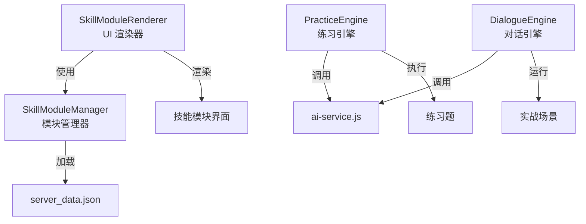

[根目录](../CLAUDE.md) > **js/**

# JS 核心模块

## 导航
[返回项目根目录](../CLAUDE.md)

## 模块职责

该目录包含前端应用的核心 JavaScript 逻辑，采用 ES Modules 组织代码，实现情商训练营的所有业务功能。

---

## 变更记录 (Changelog)

### 2026-01-14
- 完成模块文档化
- 新增技能模块系统说明
- 更新架构与依赖关系图

---

## 架构概览

```mermaid
graph TD
    App[app.js<br/>应用主控制器] --> Storage[storage.js<br/>数据存储]
    App --> AI[ai-service.js<br/>AI 服务]
    App --> Scenarios[scenarios.js<br/>场景管理]
    App --> Gamification[gamification.js<br/>游戏化]
    App --> Analytics[analytics.js<br/>数据分析]
    App --> Chart[chart.js<br/>图表组件]

    App --> Skills[modules/skills/<br/>技能模块系统]
    Skills --> SkillMgr[SkillModuleManager.js]
    Skills --> SkillRend[SkillModuleRenderer.js]
    Skills --> Practice[PracticeEngine.js]
    Skills --> Dialogue[DialogueEngine.js]
    Skills --> Humor[HumorModule.js]

    Scenarios --> Data[data/scenario_db.js<br/>场景数据库]

    Storage -->|API 调用| Server[/api/storage]
    AI -->|HTTP 请求| External[Ark API]
```

## 关键文件说明

### 核心控制器

#### app.js
**职责**: 应用主入口，负责初始化、路由、事件绑定

**主要功能**:
- 视图路由管理 (`switchView`, `showView`)
- DOM 元素管理
- 事件监听绑定
- 技能模块初始化
- 渲染协调

**关键函数**:
```javascript
// 初始化应用
async function init()

// 视图切换
function switchView(viewName)
function showView(viewName, viewData)

// 场景流程
function startScenario(categoryId)
async function handleSubmit()
function renderFeedback(feedback)

// 技能模块路由
function showSkillModuleView(moduleId)
function showTheoryView(moduleId, lessonId)
function showPracticeView(moduleId, practiceType)
function showRealWorldView(moduleId)
```

**视图系统**:
- `welcome-view`: 欢迎主页（分类选择、数据统计、历史记录）
- `training-view`: 训练界面（单次回答/AI 对话）
- `feedback-view`: 反馈界面（评分、建议、参考答案）
- `skill-module-view`: 技能模块界面（三 Tab 布局）

---

### 数据层

#### storage.js
**职责**: 数据持久化与同步

**存储策略**:
- **本地存储**: `localStorage` (离线优先)
- **远程同步**: `/api/storage` (服务器备份)
- **同步逻辑**: 启动时服务器优先，服务器空时上传本地数据

**存储 Key**:
```javascript
SETTINGS_KEY = 'eq_settings'           // API 配置
HISTORY_KEY = 'eq_history'             // 训练历史
FAVORITES_KEY = 'eq_favorites'         // 收藏题目
CUSTOM_SCENARIOS_KEY = 'eq_custom_scenarios'  // 自定义题目
```

**导出函数**:
```javascript
// 初始化存储（从服务器同步）
export async function initStorage()

// 设置管理
export function getSettings()
export function saveSettings(settings)

// 历史记录
export function getHistory()
export function saveHistory(record)

// 收藏管理
export function toggleFavorite(scenarioId)
export function isFavorite(scenarioId)

// 自定义场景
export function saveCustomScenario(scenario)
```

---

#### scenarios.js
**职责**: 场景题库管理

**场景分类**:
```javascript
const BASE_CATEGORIES = [
    { id: "职场", icon: "💼", name: "职场场景" },
    { id: "情感", icon: "❤️", name: "情感场景" },
    { id: "家庭", icon: "👨‍👩‍👧‍👦", name: "家庭场景" },
    { id: "学术", icon: "🎓", name: "学术场景" },
    { id: "社交", icon: "🤝", name: "社交场景" },
    { id: "突发", icon: "🚨", name: "突发场景" },
    { id: "自我闹事", icon: "🤦‍♂️", name: "自我闹事" },
    { id: "社会潜规则", icon: "🕶️", name: "社会潜规则" }
];
```

**导出函数**:
```javascript
export function getAllCategories()
export function getRandomScenario(categoryId)
export function getScenarioById(id)
export function getAllScenarios()
```

**场景数据结构**:
```javascript
{
    id: "work_001",
    category: "职场",
    title: "当众批评",
    description: "周一晨会上，老板当着全团队...",
    context: "周一晨会，会议室"
}
```

---

#### data/scenario_db.js
**职责**: 内置场景数据库

**数据量**: 200+ 场景，分布在 8 大分类

**数据结构**:
```javascript
export const SCENARIO_DB = {
    "work": [...],      // 职场场景（100+）
    "emotion": [...],   // 情感场景
    "family": [...],    // 家庭场景
    "academic": [...],  // 学术场景
    "social": [...],    // 社交场景
    "emergency": [...], // 突发场景
    "self": [...],      // 自我闹事
    "rules": [...]      // 社会潜规则
};
```

---

### 服务层

#### ai-service.js
**职责**: AI 评分、对话生成、场景生成

**核心功能**:

1. **响应分析** (`analyzeResponse`)
   - 评估用户回答 (0-100 分)
   - 生成优缺点反馈
   - 提供曾仕强语录
   - 输出核心公式
   - 计算六维雷达图分数

2. **角色对话** (`chatWithPersona`)
   - AI 扮演场景角色
   - 实时对话交互
   - 根据用户回答调整反应

3. **场景生成** (`generateSimilarScenario`)
   - "举一反三"功能
   - 基于现有场景生成类似题目

**AI 评分体系**:
```javascript
// 曾仕强智慧核心原则
const ZENG_PRINCIPLES = `
1. 外圆内方: 为人处世要圆融，但内心原则要坚定
2. 留面子: 看破不说破，批评人要先肯定
3. 推拖拉: 争取缓冲时间，让对方冷静
4. 合理: 根据情境调整，合情合理最高
5. 先做人后做事: 人做好了，事情差了有人兜底

// 社会生存潜规则
6. 先斩后奏: 直接做比先问许可更好
7. 信息不对称: 保持三分神秘，掌握主动
8. 利益绑定: 确保利益一致，背叛成本极高
`;
```

**六维评分**:
- 共情能力 (empathy)
- 沟通技巧 (communication)
- 情绪管理 (emotion_management)
- 冲突化解 (conflict_resolution)
- 抗压能力 (resilience)
- 社会洞察 (social_insight)

---

### 业务逻辑层

#### gamification.js
**职责**: 游戏化系统（XP、等级、徽章）

**XP 系统**:
- 完成训练: 100 XP
- 评分奖励: 额外 XP (分数值)
- 完成课程: 50 XP
- 练习得分: 分数 / 2 XP

**等级公式**:
```javascript
// Level N 需要 N * 500 XP
xpForNext = level * 500
```

**徽章系统**:
- 🐣 初出茅庐: 完成 1 次训练
- 🔨 熟能生巧: 完成 10 次训练
- 👑 情商大师: 完成 50 次训练
- 🔥 坚持不懈: 连续 3 天训练
- 📅 自律达人: 连续 7 天训练
- ✨ 完美主义: 获得 1 次 90 分以上
- 🌟 登峰造极: 获得 5 次 90 分以上

**每日挑战**:
- 基于日期的伪随机种子
- 每天固定一个场景
- 双倍 XP 奖励

---

#### analytics.js
**职责**: 数据分析与可视化

**核心功能**:
- 基础统计（总训练次数、平均分）
- 分类统计（各维度表现）
- 弱点分析（智能推荐）
- 雷达图数据生成

**导出类**:
```javascript
export class Analytics {
    getBasicStats()          // 基础统计
    getCategoryStats()       // 分类统计
    getWeaknessAnalysis()    // 弱点分析
    getRadarData()          // Chart.js 雷达图数据
}
```

---

#### chart.js
**职责**: 图表组件（Chart.js 本地版本）

用于绘制能力雷达图和其他数据可视化。

---

## 技能模块系统 (modules/skills/)

### 系统架构



### 核心模块

#### SkillModuleManager.js
**职责**: 技能模块数据管理

**功能**:
- 从 `server_data.json` 加载模块数据
- 管理用户进度（localStorage）
- 课程完成追踪
- 练习分数记录

**数据结构**:
```javascript
// 模块数据
{
    id: 'humor',
    name: '幽默表达',
    icon: '😄',
    description: '提升幽默感和表达技巧',
    theoryLessons: [...],  // 理论课
    exercises: [...],      // 练习
    scenarios: [...]       // 实战场景
}

// 进度数据
{
    completedLessons: [],
    exerciseScores: {},
    scenarioCount: 0,
    averageScore: 0,
    level: 1,
    xp: 0
}
```

**导出**:
```javascript
export const skillManager = new SkillModuleManager();
```

---

#### SkillModuleRenderer.js
**职责**: UI 渲染与事件处理

**主要功能**:
1. 渲染技能卡片网格
2. 渲染模块详情页（三 Tab）
3. 渲染理论课列表与内容
4. 渲染练习列表
5. 渲染实战场景列表
6. 事件委托处理

**UI 组件**:
- `.skills-grid`: 技能卡片容器
- `.skill-card`: 单个技能卡片
- `.lesson-item`: 课程列表项
- `.exercise-item`: 练习列表项
- `.scenario-item`: 场景列表项

**Tab 系统**:
- 📚 理论课 (theory)
- ✍️ 练习 (practice)
- 🌍 实战 (realworld)

**导出**:
```javascript
export const skillRenderer = new SkillModuleRenderer();
```

---

#### PracticeEngine.js
**职责**: 练习执行引擎

**功能**:
- 加载练习数据
- 渲染练习界面
- 处理用户提交
- 调用 AI 评分
- 显示反馈

**支持的练习类型**:
- `complete_sentence`: 补全句子
- `rewrite`: 改写
- `scenario`: 场景题
- `quiz`: 选择题
- `reflection`: 反思题
- `roleplay`: 角色扮演

---

#### DialogueEngine.js
**职责**: 实战对话引擎

**功能**:
- 初始化场景对话
- AI 角色扮演
- 实时对话交互
- 对话评估

---

#### HumorModule.js
**职责**: 幽默表达模块示例

**功能**:
- 提供评分 Prompt
- 提供对话 Prompt
- 定义评分维度

**评分维度**:
- 意外性 (30%)
- 适切性 (25%)
- 创意性 (25%)
- 表达自然度 (20%)

---

## 依赖关系

### 内部依赖
```
app.js
├── storage.js
├── scenarios.js
├── analytics.js
├── gamification.js
├── ai-service.js
├── chart.js
└── modules/skills/
    ├── SkillModuleManager.js
    ├── SkillModuleRenderer.js
    ├── PracticeEngine.js
    ├── DialogueEngine.js
    └── HumorModule.js

scenarios.js
└── data/scenario_db.js
```

### 外部依赖
- **Chart.js**: 图表库（本地版本）
- **无框架依赖**: 纯原生 JavaScript

---

## 对外接口

### 应用级 API (window 对象)

#### 路由系统
```javascript
// 基础视图切换
switchView('welcome' | 'training' | 'feedback')

// 扩展路由系统
showView('skill-module', { moduleId })
showView('skill-theory', { moduleId, lessonId })
showView('skill-practice', { moduleId, practiceType })
showView('skill-realworld', { moduleId })
```

#### 模块访问
```javascript
// 技能模块管理器
window.skillManager

// 技能模块渲染器
window.skillRenderer
```

### ES Module 导出

#### storage.js
```javascript
export async function initStorage()
export function getSettings()
export function saveSettings(settings)
export function getHistory()
export function saveHistory(record)
export function toggleFavorite(scenarioId)
export function isFavorite(scenarioId)
export function saveCustomScenario(scenario)
```

#### scenarios.js
```javascript
export function getAllCategories()
export function getRandomScenario(categoryId)
export function getScenarioById(id)
export function getAllScenarios()
```

#### ai-service.js
```javascript
export async function analyzeResponse(scenario, userAnswer, settings)
export async function chatWithPersona(messages, scenario, settings)
export async function generateSimilarScenario(baseScenario, settings)
```

#### gamification.js
```javascript
export class Gamification {
    static getLevelProgress(history)
    static checkAchievements(history)
    static getDailyChallenge()
}
```

#### analytics.js
```javascript
export class Analytics {
    getBasicStats()
    getCategoryStats()
    getWeaknessAnalysis()
    getRadarData()
}
```

#### modules/skills/SkillModuleManager.js
```javascript
export class SkillModuleManager {
    async loadModules()
    getAllModules()
    getModule(moduleId)
    getLesson(moduleId, lessonId)
    getModuleProgress(moduleId)
    updateModuleProgress(moduleId, data)
    completeLesson(moduleId, lessonId)
    recordExerciseScore(moduleId, exerciseId, score)
}

export const skillManager
```

#### modules/skills/SkillModuleRenderer.js
```javascript
export class SkillModuleRenderer {
    renderSkillCards(container)
    renderSkillModuleInterface(module)
    renderTheoryTab(moduleId)
    renderPracticeTab(moduleId)
    renderRealWorldTab(moduleId)
    showToast(message, type)
}

export const skillRenderer
```

---

## 开发规范

### 代码风格
- **异步操作**: 统一使用 `async/await`
- **模块导入**: 使用 ES6 `import/export`
- **事件处理**: 使用事件委托避免内存泄漏
- **错误处理**: 使用 `try/catch` 捕获异步错误

### 安全考虑
- **XSS 防护**: 对用户输入进行 HTML 转义
- **数据验证**: 验证 API 返回数据结构
- **错误提示**: 用户友好的错误消息

### 性能优化
- **事件委托**: 减少事件监听器数量
- **懒加载**: 按需加载模块数据
- **防抖节流**: 对频繁操作进行优化

---

## 测试与调试

### 调试技巧
1. **浏览器控制台**: 直接查看日志和变量
2. **网络面板**: 查看 API 请求
3. **应用面板**: 查看 localStorage 数据
4. **测试数据**: 设置 -> 开发者选项 -> 写入测试数据

### 常见问题

#### Q: 如何添加新的技能模块？
A: 在 `server_data.json` 的 `skillModules` 字段中添加新模块数据。

#### Q: 如何修改 AI 评分逻辑？
A: 编辑 `ai-service.js` 中的 `analyzeResponse` 函数和 `ZENG_PRINCIPLES`。

#### Q: 如何新增练习类型？
A: 在 `PracticeEngine.js` 中添加对应的渲染逻辑。

---

## 相关文件清单

### 核心文件
- `app.js` - 应用主控制器
- `storage.js` - 数据存储
- `scenarios.js` - 场景管理
- `ai-service.js` - AI 服务
- `gamification.js` - 游戏化
- `analytics.js` - 数据分析
- `chart.js` - 图表组件

### 数据文件
- `data/scenario_db.js` - 场景数据库

### 技能模块
- `modules/skills/SkillModuleManager.js` - 模块管理器
- `modules/skills/SkillModuleRenderer.js` - UI 渲染器
- `modules/skills/PracticeEngine.js` - 练习引擎
- `modules/skills/DialogueEngine.js` - 对话引擎
- `modules/skills/HumorModule.js` - 幽默模块

---

*Generated by Claude Code Assistant - 2026-01-14*
