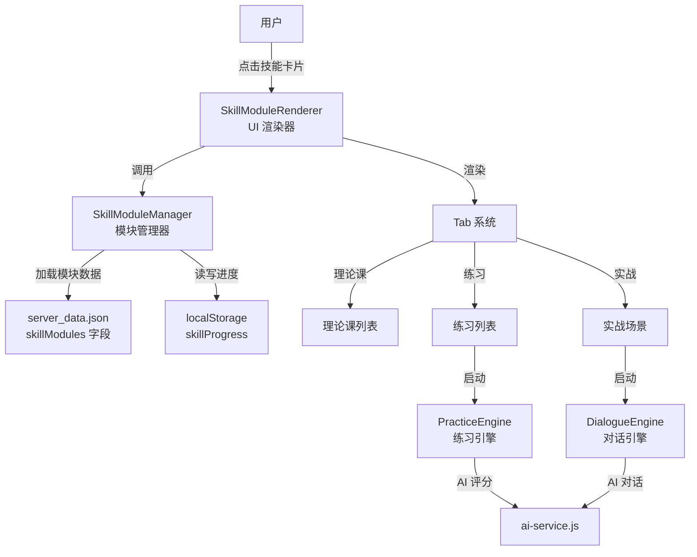
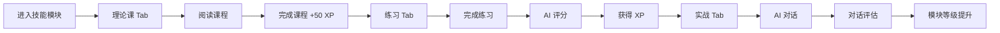

[根目录](../../../CLAUDE.md) > [js](../../CLAUDE.md) > **modules/skills/**

# 技能模块系统

## 导航
[返回项目根目录](../../../CLAUDE.md) | [返回 JS 模块](../../CLAUDE.md)

## 模块职责

技能模块系统是情商训练营的核心学习系统，采用"理论课 + 练习 + 实战"三位一体的学习路径，帮助用户系统性地提升特定情商技能。

---

## 变更记录 (Changelog)

### 2026-01-14
- 完成技能模块系统文档化
- 新增架构与数据流说明
- 完善接口与开发指南

---

## 系统架构



---

## 核心组件

### 1. SkillModuleManager.js

**职责**: 模块数据管理、进度追踪

**主要功能**:
```javascript
class SkillModuleManager {
    // 数据加载
    async loadModules()
    getAllModules()
    getModule(moduleId)
    getLesson(moduleId, lessonId)

    // 进度管理
    loadProgress()
    saveProgress()
    getModuleProgress(moduleId)
    updateModuleProgress(moduleId, data)

    // 学习追踪
    completeLesson(moduleId, lessonId)
    recordExerciseScore(moduleId, exerciseId, score)
}
```

**模块数据结构**:
```javascript
// server_data.json 中的模块定义
{
    "skillModules": {
        "humor": {
            "id": "humor",
            "name": "幽默表达",
            "icon": "😄",
            "description": "提升幽默感和表达技巧",
            "theoryLessons": [
                {
                    "id": "humor_01",
                    "title": "幽默的本质",
                    "duration": "10",
                    "content": "<p>课程内容 HTML...</p>",
                    "keyPoints": ["要点1", "要点2"]
                }
            ],
            "exercises": [
                {
                    "id": "humor_ex_01",
                    "type": "complete_sentence",
                    "title": "补全笑话",
                    "difficulty": 1,
                    "description": "将这句话变得更幽默..."
                }
            ],
            "scenarios": [
                {
                    "id": "humor_scenario_01",
                    "title": "化解尴尬",
                    "description": "在正式场合说错话...",
                    "category": "社交"
                }
            ]
        }
    }
}
```

**进度数据结构**:
```javascript
// localStorage 中的进度数据
{
    "skillProgress": {
        "humor": {
            "completedLessons": ["humor_01", "humor_02"],
            "exerciseScores": {
                "humor_ex_01": 85,
                "humor_ex_02": 90
            },
            "scenarioCount": 5,
            "averageScore": 87,
            "level": 2,
            "xp": 450
        }
    }
}
```

---

### 2. SkillModuleRenderer.js

**职责**: UI 渲染、事件处理、Tab 管理

**渲染层级**:
```
技能卡片网格 (主页)
    ↓ 点击卡片
技能模块详情页
    ├── Tab 导航 (理论课 / 练习 / 实战)
    └── Tab 内容区域
        ├── 理论课列表 → 课程详情
        ├── 练习列表 → 练习界面
        └── 实战场景列表 → 对话界面
```

**核心方法**:
```javascript
class SkillModuleRenderer {
    // 主页渲染
    renderSkillCards(container)
    renderSkillCard(module)

    // 模块详情页
    renderSkillModuleInterface(module)

    // Tab 渲染
    renderTheoryTab(moduleId)
    renderPracticeTab(moduleId)
    renderRealWorldTab(moduleId)

    // 课程详情
    showLessonContent(moduleId, lessonId)

    // 启动引擎
    startExercise(moduleId, exerciseId)
    startScenario(moduleId, scenarioId)

    // 工具方法
    showToast(message, type)
    escapeHtml(unsafe)
}
```

**事件委托架构**:
```javascript
// 所有点击事件统一在模块视图上处理
attachModuleViewEvents(moduleId) {
    const delegator = (e) => {
        // 处理返回按钮
        if (e.target.closest('#back-to-skills-btn')) { ... }

        // 处理 Tab 切换
        if (e.target.closest('.tab-btn')) { ... }

        // 处理课程点击
        if (e.target.closest('.lesson-item')) { ... }

        // 处理练习点击
        if (e.target.closest('.exercise-item')) { ... }

        // 处理场景点击
        if (e.target.closest('.scenario-item')) { ... }
    };
    moduleView.addEventListener('click', delegator);
}
```

**UI 组件**:
- `.skills-grid`: 技能卡片网格容器
- `.skill-card`: 单个技能卡片
  - `.skill-icon`: 技能图标
  - `.skill-name`: 技能名称
  - `.skill-level`: 等级徽章
  - `.skill-progress`: 进度条
- `.lesson-item`: 课程列表项
- `.exercise-item`: 练习列表项
- `.scenario-item`: 场景列表项
- `.toast`: 消息提示组件

---

### 3. PracticeEngine.js

**职责**: 练习执行引擎

**支持的练习类型**:
```javascript
const EXERCISE_TYPES = {
    'complete_sentence': '📝 补全句子',
    'rewrite': '✍️ 改写',
    'scenario': '💭 场景题',
    'quiz': '📝 选择题',
    'reflection': '📝 反思题',
    'roleplay': '🎭 角色扮演'
};
```

**执行流程**:
```javascript
class PracticeEngine {
    constructor(moduleId)

    // 启动练习
    async startExercise(exerciseId)

    // 渲染界面（根据类型）
    renderCompleteSentence(exercise)
    renderRewrite(exercise)
    renderScenario(exercise)
    renderQuiz(exercise)

    // 处理提交
    async handleSubmit()

    // AI 评分
    async scoreAnswer(userAnswer)

    // 显示反馈
    showFeedback(result)
}
```

---

### 4. DialogueEngine.js

**职责**: 实战对话引擎

**对话流程**:
```javascript
class DialogueEngine {
    constructor(moduleId, scenarioId)

    // 初始化对话
    initialize(container)

    // 发送消息
    async sendMessage(userMessage)

    // AI 回复
    async getAIResponse(messages)

    // 更新对话历史
    updateChatHistory(role, content)

    // 结束对话并评估
    async endAndEvaluate()
}
```

**对话界面结构**:
```
┌─────────────────────────────┐
│  对话历史区域               │
│  - AI: 初始化消息           │
│  - 用户: 回复 1             │
│  - AI: 回复 2               │
└─────────────────────────────┘
┌─────────────────────────────┐
│  输入框                     │
│  [发送按钮] [结束对话按钮]  │
└─────────────────────────────┘
```

---

### 5. HumorModule.js

**职责**: 幽默表达模块示例（Prompt 定义）

**评分 Prompt**:
```javascript
static getScoringPrompt(userAnswer) {
    return `
你是一个幽默感评估专家。评估用户的回答：${userAnswer}

评分维度（每项0-100分）：
1. 意外性（30%）：是否打破预期，有反转
2. 适切性（25%）：是否适合场合，不冒犯他人
3. 创意性（25%）：是否有新意，不老套
4. 表达自然度（20%）：是否自然流畅，不生硬

请以JSON格式返回：
{
  "score": 总分（0-100）,
  "dimensionScores": { ... },
  "feedback": "简短评价",
  "highlights": ["亮点1"],
  "suggestions": ["改进建议1"],
  "betterAnswer": "更幽默的回答示例"
}
`;
}
```

**对话 Prompt**:
```javascript
static getChatPrompt(scenario) {
    return `
你是一个幽默训练的AI对话伙伴。

【场景信息】
场景描述：${scenario.description}
你的角色：${scenario.role}
用户目标：${scenario.goal}

【任务要求】
1. 扮演${scenario.role}这个角色
2. 观察并评估用户的幽默表现
3. 保持轻松友好的对话氛围
4. 给用户提供练习幽默的机会
`;
}
```

---

## 数据流

### 学习路径



### 进度更新

```javascript
// 完成课程
skillManager.completeLesson(moduleId, lessonId)
// → progress.completedLessons.push(lessonId)
// → progress.xp += 50

// 记录练习分数
skillManager.recordExerciseScore(moduleId, exerciseId, score)
// → progress.exerciseScores[exerciseId] = score
// → progress.xp += Math.floor(score / 2)
// → progress.averageScore = 重新计算

// 完成实战场景
// → progress.scenarioCount += 1
// → progress.xp += 100
```

---

## Tab 系统

### 理论课 Tab (Theory)

**UI 结构**:
```
┌─────────────────────────────┐
│ 课程 1  ✓  10分钟  已完成   │
│ 课程 2  →  15分钟           │
│ 课程 3  🔒  12分钟  锁定    │
└─────────────────────────────┘
```

**解锁逻辑**:
- 课程 1 默认解锁
- 课程 N 需要完成课程 N-1

**课程详情**:
```
┌─────────────────────────────┐
│ ← 返回课程列表              │
│                             │
│ 课程标题                    │
│ ⏱️ 10 分钟                  │
│                             │
│ 课程内容（HTML）            │
│                             │
│ 🎯 核心要点                 │
│  • 要点 1                   │
│  • 要点 2                   │
│                             │
│  [✓ 完成课程 (+50 XP)]      │
└─────────────────────────────┘
```

---

### 练习 Tab (Practice)

**UI 结构**:
```
┌─────────────────────────────┐
│ 练习列表                    │
│                             │
│ 📝 补全句子                 │
│ 难度: ⭐                    │
│ 将这句话变得更幽默...       │
│                             │
│ ✍️ 改写                     │
│ 难度: ⭐⭐                  │
│ 用幽默的方式重写...         │
└─────────────────────────────┘
```

**练习界面** (示例: 补全句子):
```
┌─────────────────────────────┐
│ 📝 补全句子                 │
│ 难度: ⭐                    │
│                             │
│ 题目：                      │
│ "今天天气真好，_____"       │
│                             │
│ 你的答案：                  │
│ [________________]          │
│                             │
│ [提交答案]                  │
└─────────────────────────────┘
```

**反馈界面**:
```
┌─────────────────────────────┐
│ 得分：85 分                 │
│                             │
│ 亮点：                      │
│  ✓ 有反转                   │
│  ✓ 表达自然                 │
│                             │
│ 改进建议：                  │
│  ⚠️ 可以更出人意料           │
│                             │
│ 更好的答案：                │
│ "今天天气真好，好到我都想   │
│  去上班了！"                │
│                             │
│ [返回练习列表]              │
└─────────────────────────────┘
```

---

### 实战 Tab (RealWorld)

**UI 结构**:
```
┌─────────────────────────────┐
│ 🌍 实战演练                 │
│ 在真实场景中应用你学到的... │
│                             │
│ 🏆 已完成场景: 5            │
│                             │
│ 可选场景：                  │
│                             │
│ 场景 1：化解尴尬            │
│ 在正式场合说错话...         │
│ 难度: 中等                  │
│                             │
│ 场景 2：破冰聊天            │
│ 第一次见面...              │
└─────────────────────────────┘
```

**对话界面**:
```
┌─────────────────────────────┐
│ 对话历史                    │
│                             │
│ AI (主持人):                │
│ 欢迎来到今天的聚会，请...   │
│                             │
│ 用户:                       │
│ 谢谢邀请，我很高兴...        │
│                             │
│ AI (主持人):                │
│ 那能和我们分享一个...       │
└─────────────────────────────┘
┌─────────────────────────────┐
│ [输入框...]  [发送]         │
│              [结束对话]      │
└─────────────────────────────┘
```

---

## 开发指南

### 添加新的技能模块

1. **在 `server_data.json` 中定义模块**:
```json
{
  "skillModules": {
    "new_skill": {
      "id": "new_skill",
      "name": "新技能",
      "icon": "🎯",
      "description": "技能描述",
      "theoryLessons": [...],
      "exercises": [...],
      "scenarios": [...]
    }
  }
}
```

2. **创建模块特定的 Prompt 文件** (可选):
```javascript
// modules/skills/NewSkillModule.js
export class NewSkillModule {
    static getScoringPrompt(userAnswer) { ... }
    static getChatPrompt(scenario) { ... }
}
```

3. **重新加载页面**，模块会自动出现在技能卡片网格中。

---

### 添加新的练习类型

1. **在 `PracticeEngine.js` 中添加渲染方法**:
```javascript
renderNewType(exercise) {
    return `
        <div class="exercise-new-type">
            <!-- 练习界面 HTML -->
        </div>
    `;
}
```

2. **添加提交处理逻辑**:
```javascript
async handleSubmit() {
    if (this.exercise.type === 'new_type') {
        // 处理新类型的提交
    }
}
```

3. **在 `SkillModuleRenderer.js` 中更新类型标签**:
```javascript
getExerciseTypeLabel(type) {
    const labels = {
        'new_type': '🆕 新类型',
        // ...
    };
    return labels[type] || '📝 练习';
}
```

---

## 接口说明

### SkillModuleManager

```javascript
// 数据加载
async loadModules(): Promise<Object>
getAllModules(): Array<Object>
getModule(moduleId: string): Object | null
getLesson(moduleId: string, lessonId: string): Object | null

// 进度管理
getModuleProgress(moduleId: string): Object | null
updateModuleProgress(moduleId: string, data: Object): Object

// 学习追踪
completeLesson(moduleId: string, lessonId: string): void
recordExerciseScore(moduleId: string, exerciseId: string, score: number): void
```

### SkillModuleRenderer

```javascript
// 主页渲染
renderSkillCards(container: HTMLElement): void

// 模块详情
renderSkillModuleInterface(module: Object): void

// Tab 渲染
renderTheoryTab(moduleId: string): void
renderPracticeTab(moduleId: string): void
renderRealWorldTab(moduleId: string): void

// 工具方法
showToast(message: string, type: string): void
escapeHtml(unsafe: string): string
```

---

## 相关文件清单

### 核心文件
- `SkillModuleManager.js` - 模块管理器
- `SkillModuleRenderer.js` - UI 渲染器
- `PracticeEngine.js` - 练习引擎
- `DialogueEngine.js` - 对话引擎
- `HumorModule.js` - 幽默模块示例

### 依赖
- `../../storage.js` - 数据存储
- `../../ai-service.js` - AI 服务

---

*Generated by Claude Code Assistant - 2026-01-14*
